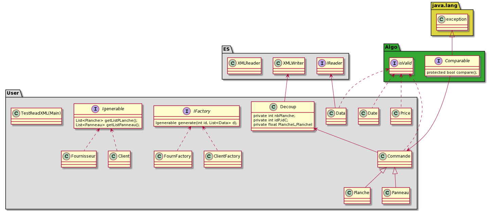

# Projxml
~ Projet Java 2021/2022
Le projet est divisé en deux gros partie partie 2 + algorithme 3.1 puis la partie 3.2.
Le projet peut être lancé en lançant le test le TestReadXml qui se trouve dans le package User.

